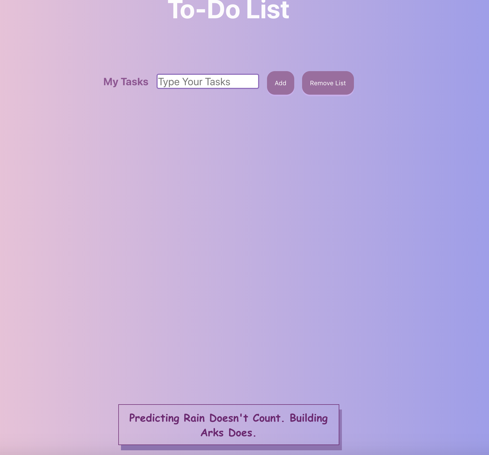

# **To-Do List**
It is a website were the user can add thier list of tasks and mark it as completed, clear one item form the list, and remove all the items from the list. Also, there is a quote that will display to the user and it is changing once every day.</br>
</br>


# Techniques:
**1- Clear item button:**</br>
In App.js there is a function that clears one item from the list, it has an index as a parameter and specifiy the number of the items to be removed from the list. Then modified the map method to have a listData and index as parameter to call  it in the ToDoList ans use it for the clear item button.
```js
clearItem = (index)=>{ // clears one item from the list
    const copyItem = this.state.myList.splice(index,1); // remove one item from the array
    this.setState({
     task:copyItem //  update the state with the new copy
    })
  }
```

```js
const toDoList = this.state.myList.map((listData,index) => { // map the myList array to the new variable toDoList
    return (
    
    <ToDoList mylist={listData} index = {index} clearItem={this.clearItem}/> // creates object for the component ToDoList to use it in onother component
    );
})
```


**2- Check the To-Do list if it is empty or not:**
```js
 { toDoList.length === 0 ? "" : toDoList} {/* check if toDoList is empty or not */}
```
**3- Align the content of the div to the buttom and push it down when the user adds more list using css:**
```css
.container{
  font-weight: bold;
  font-size: 30px;
  position: relative;
  height: auto;
  min-height: 90vh;
  padding-bottom: 100px;
  
}
.containerQuotes{
  position: absolute;
  bottom: 20px;
  left: 0;
  right: 0;
}
```
# Features:</br>
 1- Removing an item from the list.</br>
 ```js
 clearItem = (index)=>{ // clears one item from the list
    const copyItem = this.state.myList.splice(index,1); // remove one item from the array
    this.setState({
     task:copyItem //  update the state with the new copy
    })
  }
  ```
  2- Building a responsive web page using CSS. </br>
  ```css
  @media only screen and (max-width: 560px) {

  h1{

    font-size: 20px;
  }
  p{
    color: rgba(82, 6, 85, 0.952);
    font-size: 10px;
    font-weight: bold;
    width: 200px
  }
  body {
    background: #454491;  /* fallback for old browsers */
    background: -webkit-linear-gradient(to right, #eec1cc, #a5a4ca);  /* Chrome 10-25, Safari 5.1-6 */
    background: linear-gradient(to right, #ecafbe, #a7a6ec); /* W3C, IE 10+/ Edge, Firefox 16+, Chrome 26+, Opera 12+, Safari 7+ */
  }
} 
```
3- Clearing all items:
```js
clearList = ()=>{ //clears all the list from the array
    this.setState({
      myList: [] // let the array empty
    })
  }
  ```
  4- Using 3rd party API with Axios:
  ```js
  componentDidMount(){ // it allows to work with axios methods.
    console.log('hi');
    axios({
      method: 'get',
      url: "https://quotes.rest/qod.json" // the url for the quote that changes everday
    }).then((response) => {
      console.log(response.data.contents.quotes[0].quote) // print the quotes in the console
      this.setState({
        quotes: response.data.contents.quotes[0].quote, // update the new value for the qoutes
      })
      // console.log(response)
    })
  .catch((error) => {console.log(error)});
  
}
```
4- Marking the item as complete:
This function is in ToDoList component 
```js
hideList= ()=>{ // function that marks the item as complete
      
      if (this.state.hide==="false"){
          this.setState({hide:'hidden'})
      }else{
          this.setState({hide:"false"})
      }
    //   console.log('hello');
    }
```
# Difficulties:</br>
 1- Removing an item from the list.</br>
 2- Saving data to localstorage or API.</br>
 3- Align the quotes to the buttom of the page.</br> 
 4- Using a 3rd party library.</br> 

# favourite part:
1- Desiging and styling the web page.</br>
2- Practicing and learning with React, Axios, JavaScript.</br>

# Future plans:
1- Saving data to localstorage or API.</br>
2- Adding calendar to let the user choose the date for their tasks and time.</br>
3- Adding the weather API.</br>

# Acknowledgement:
I would like to thank Michael Finneran,Ghadeer Alkhathlan, Usman Bashir, and Fajrs Albakiri for helping and assisting me in this project.

